# UML 图索引

每个手写 C++ 类对应一张类图，每个完成的流程对应一张时序图。
`.mmd` 为可编辑 Mermaid 源码，`.svg` 为矢量图，`.png` 为预览图。Qt 库类及自动生成的 UI 类型仅作为关联节点显示。

## 类图

- [HttpClient 源码](uml/HttpClient.mmd) · [SVG](uml/网络请求类图.svg)

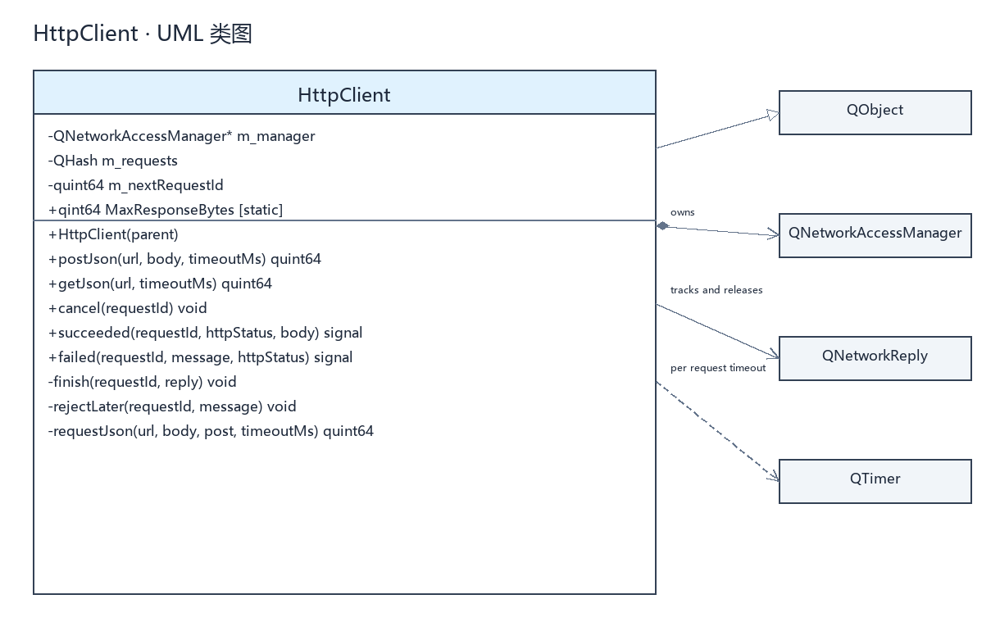

- [LoginModel 源码](uml/LoginModel.mmd) · [SVG](uml/登录模型类图.svg)

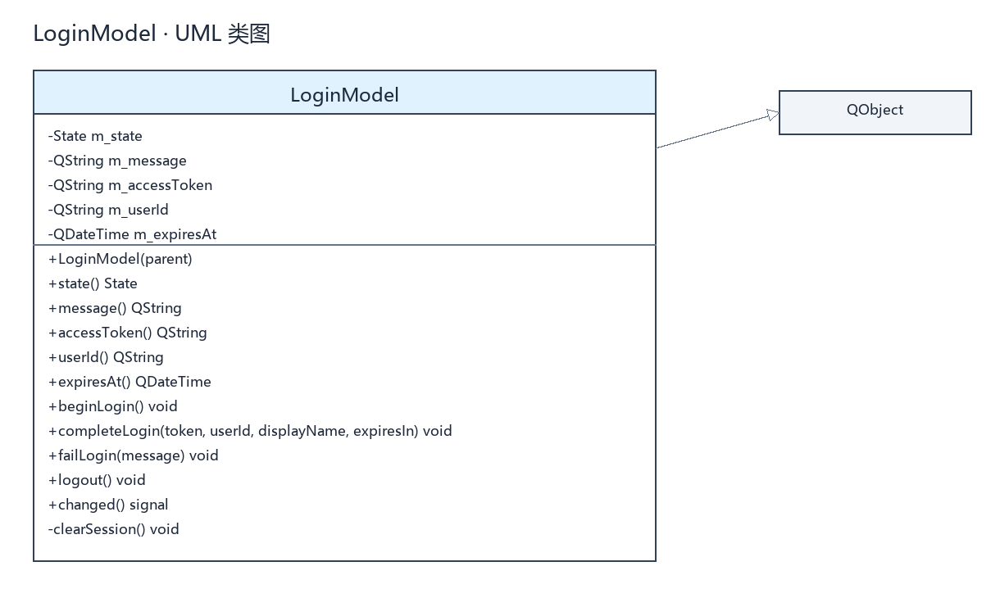

- [MainWindow 源码](uml/MainWindow.mmd) · [SVG](uml/主窗口类图.svg)

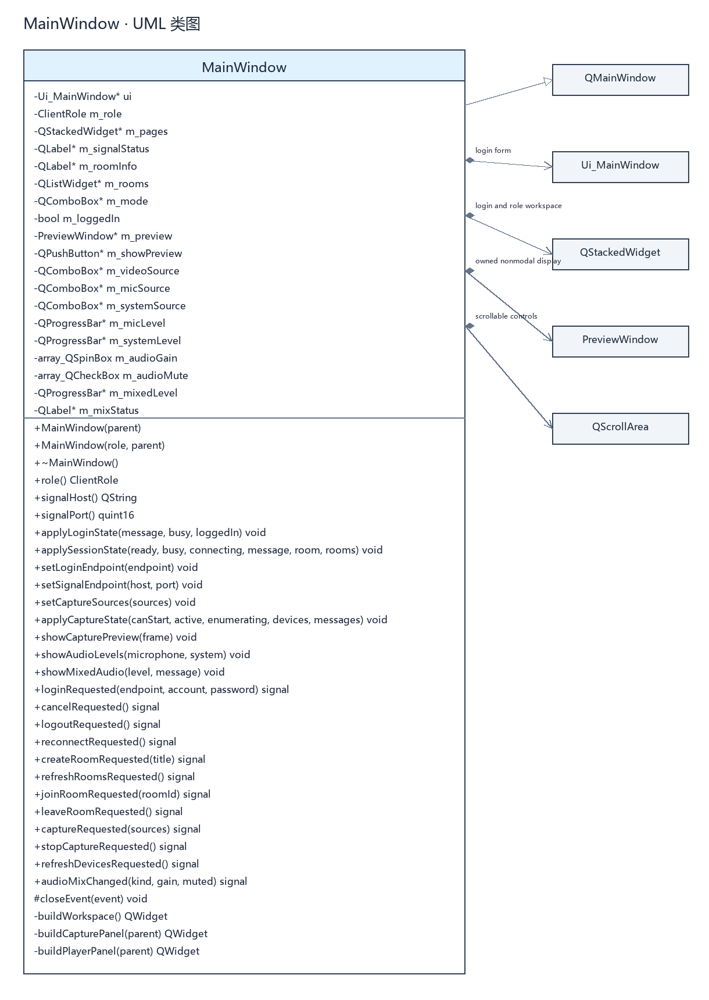

- [LoginController 源码](uml/LoginController.mmd) · [SVG](uml/登录控制器类图.svg)

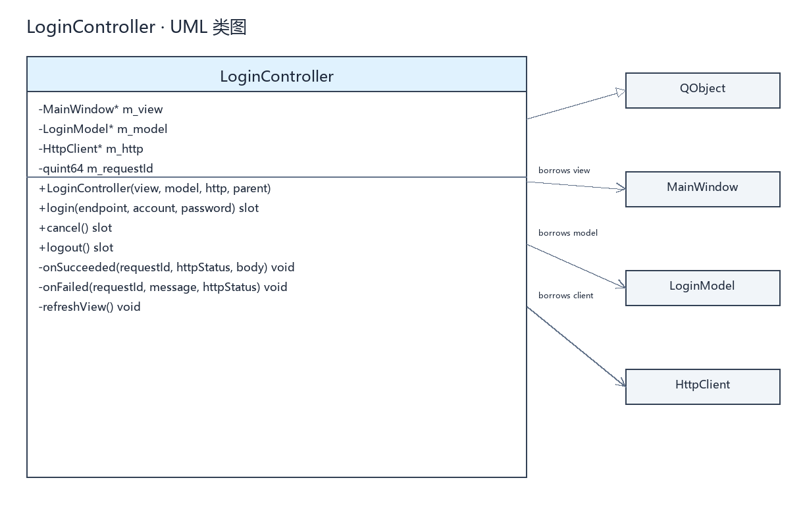

- [LocalAuthServer 类图源码](uml/LocalAuthServer.mmd) · [SVG](uml/本地认证服务类图.svg)

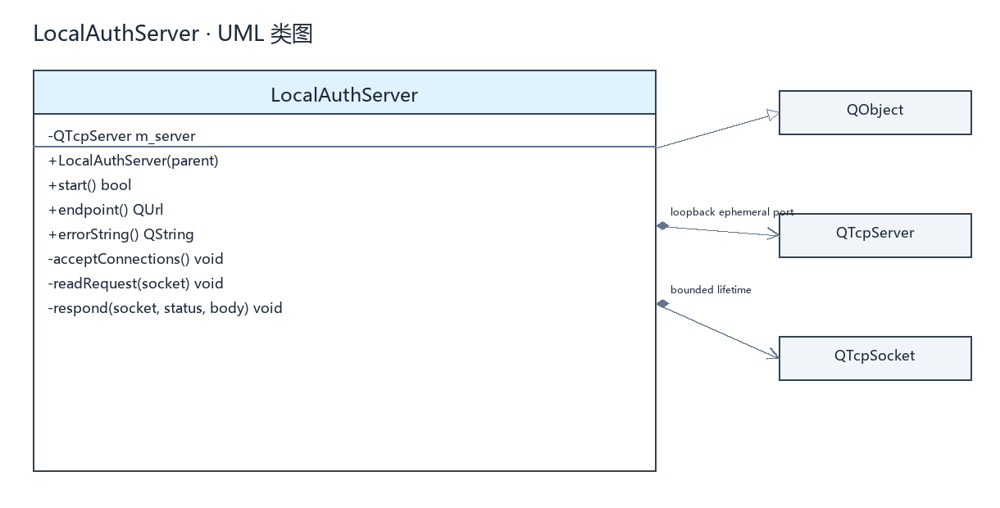

## 时序图

- [容器开发连接源码](uml/docker-dev.mmd) · [SVG](uml/容器开发连接时序图.svg)

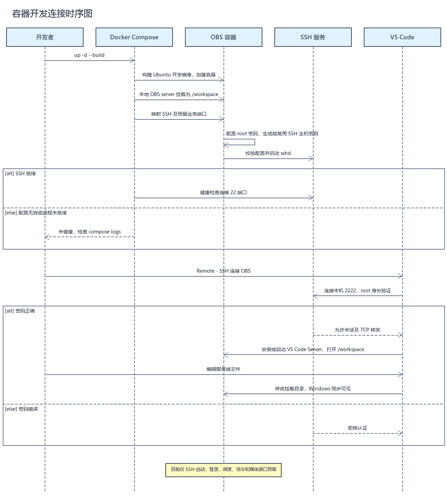

- [本地开发认证源码](uml/local-auth.mmd) · [SVG](uml/本地认证时序图.svg)

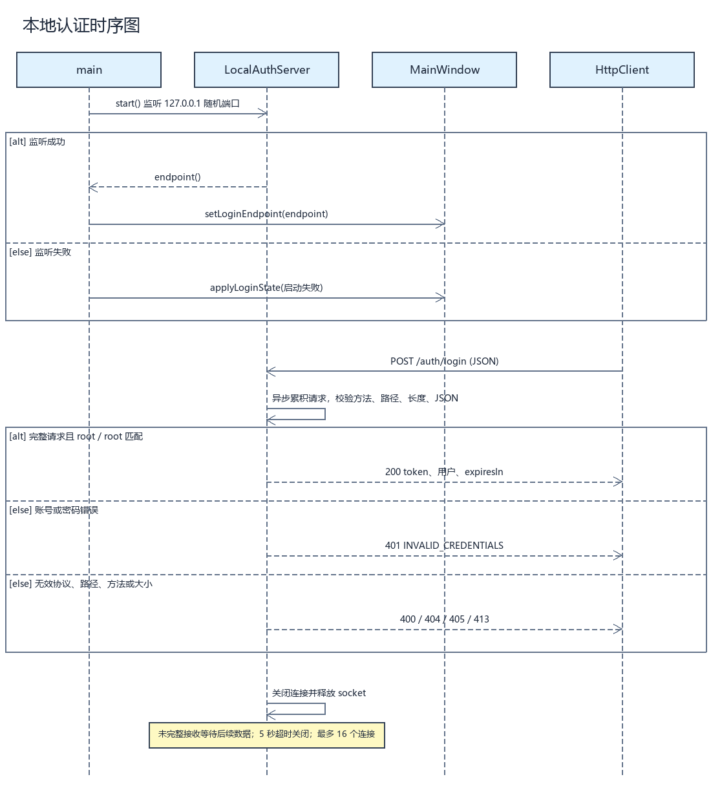

- [HTTP 请求源码](uml/http-request.mmd) · [SVG](uml/网络请求时序图.svg)

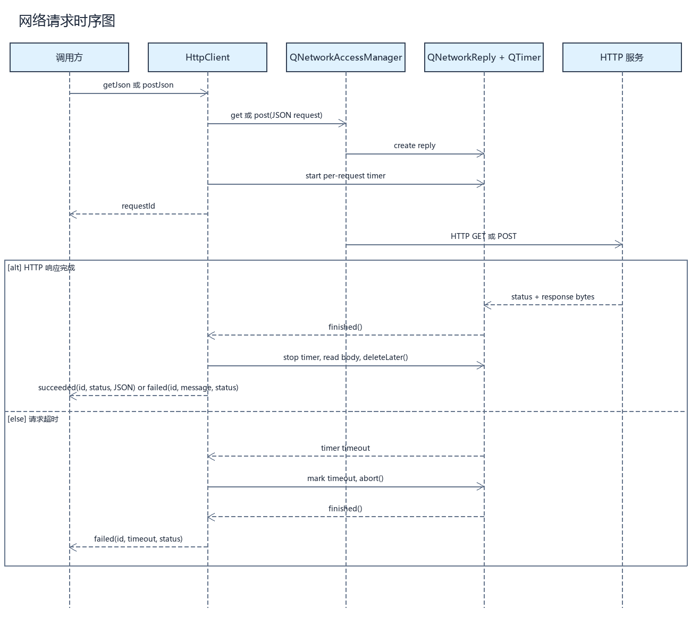

- [登录源码](uml/login.mmd) · [SVG](uml/登录时序图.svg)

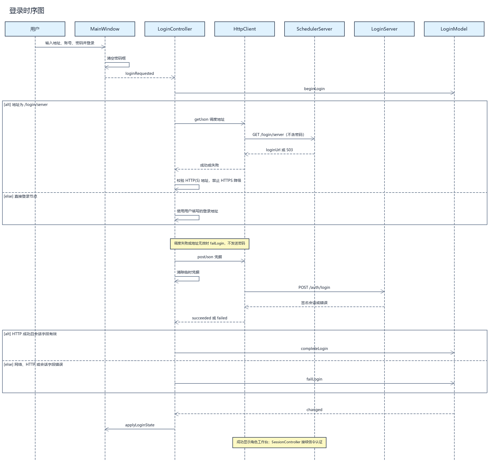

- [取消登录源码](uml/cancel-login.mmd) · [SVG](uml/取消登录时序图.svg)

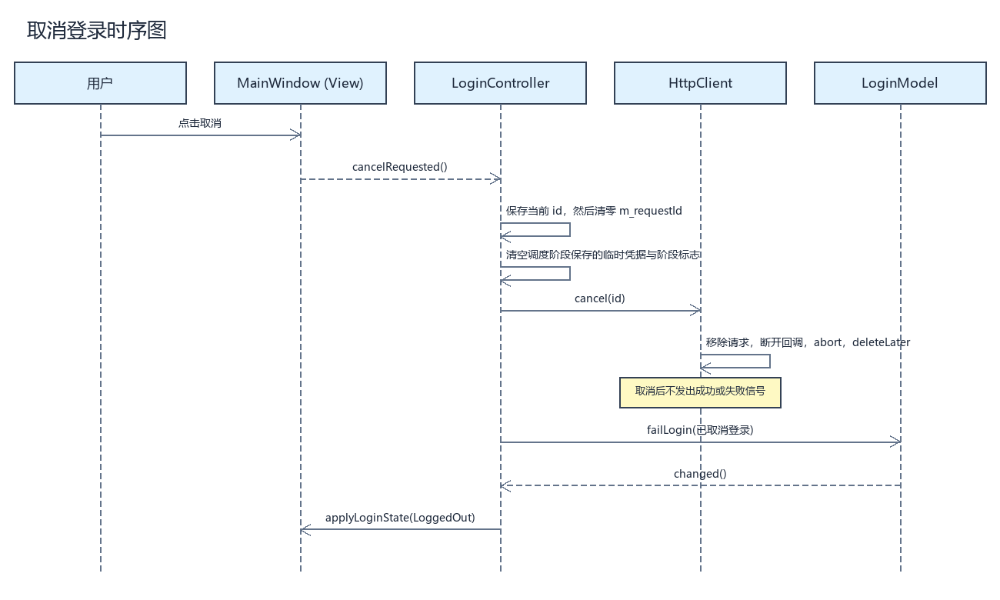

- [本地退出源码](uml/logout.mmd) · [SVG](uml/退出登录时序图.svg)

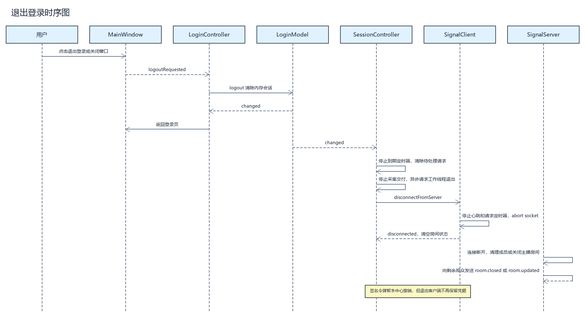

## 更新图像

安装了 Pillow 的 Python 环境中执行 `python scripts/render_uml.py`。
工程脚本支持本目录当前使用的 Mermaid 子集。修改源码后重新生成，并检查图像和代码是否一致。
