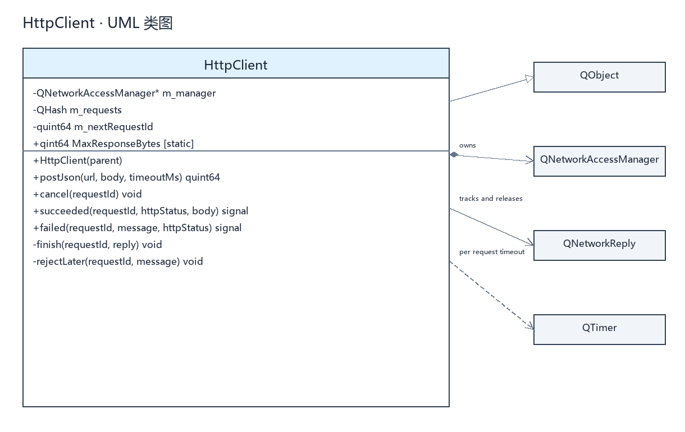
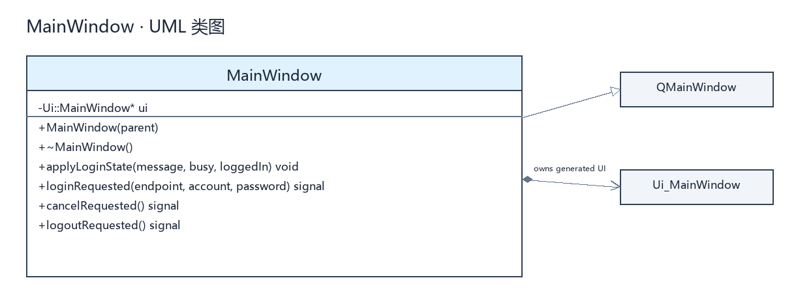
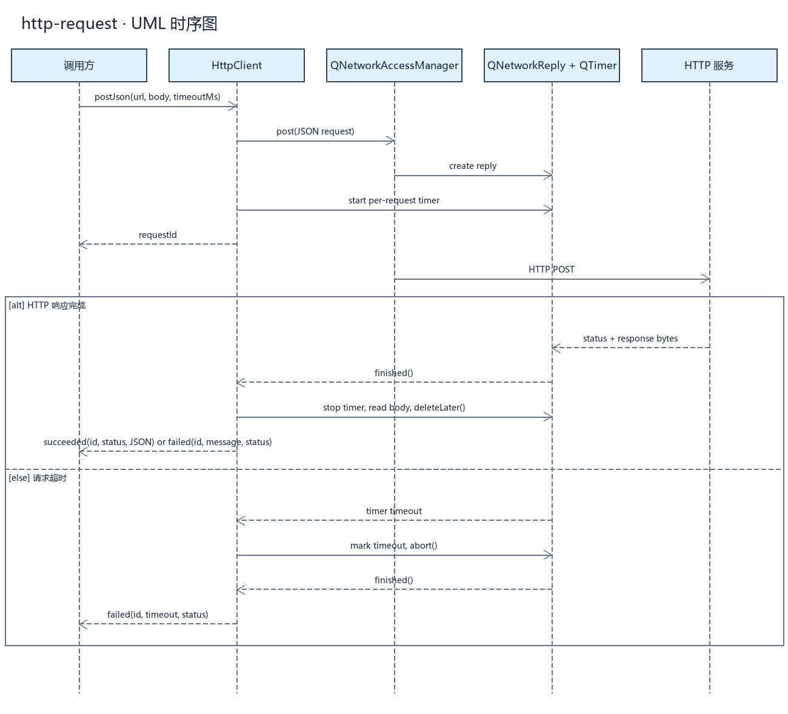
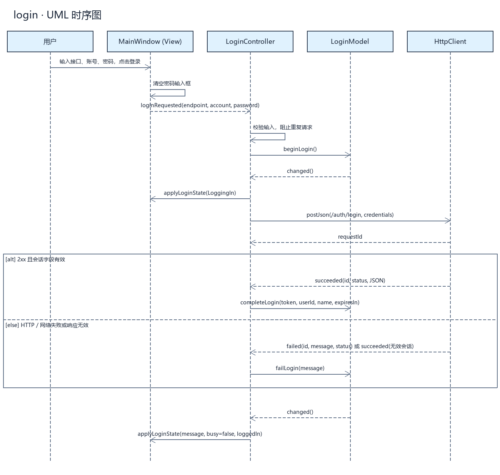
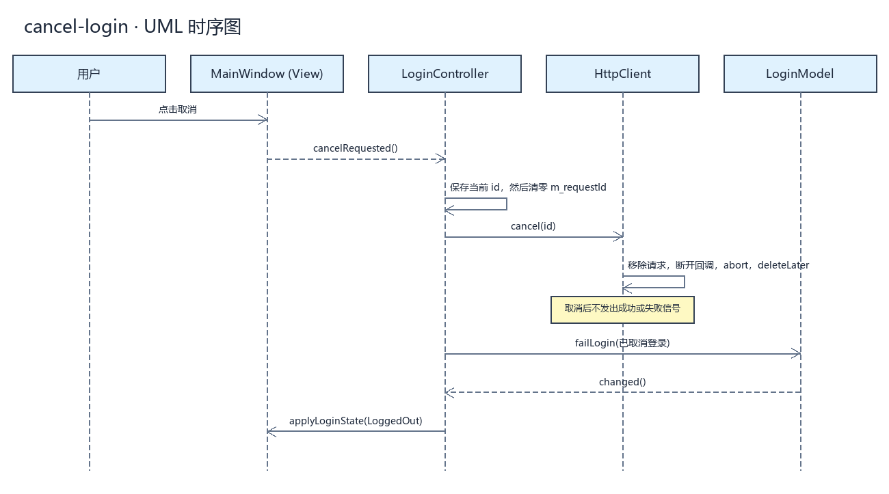
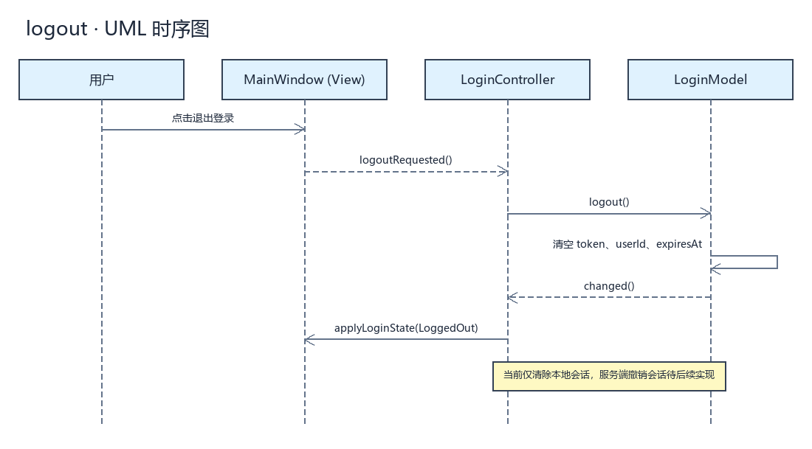

# UML 图索引

每个手写 C++ 类对应一张类图，每个完成的流程对应一张时序图。
`.mmd` 为可编辑 Mermaid 源码，`.svg` 为矢量图，`.png` 为预览图。Qt 库类及自动生成的 UI 类型仅作为关联节点显示。

## 类图

- [HttpClient 源码](classes/HttpClient.mmd) · [SVG](classes/HttpClient.svg)

- [LoginModel 源码](classes/LoginModel.mmd) · [SVG](classes/LoginModel.svg)

- [MainWindow 源码](classes/MainWindow.mmd) · [SVG](classes/MainWindow.svg)

- [LoginController 源码](classes/LoginController.mmd) · [SVG](classes/LoginController.svg)

## 时序图

- [HTTP 请求源码](sequences/http-request.mmd) · [SVG](sequences/http-request.svg)

- [登录源码](sequences/login.mmd) · [SVG](sequences/login.svg)

- [取消登录源码](sequences/cancel-login.mmd) · [SVG](sequences/cancel-login.svg)

- [本地退出源码](sequences/logout.mmd) · [SVG](sequences/logout.svg)

## 更新图像

安装了 Pillow 的 Python 环境中执行 `python scripts/render_uml.py`。
工程脚本支持本目录当前使用的 Mermaid 子集。修改源码后重新生成，并检查图像和代码是否一致。
